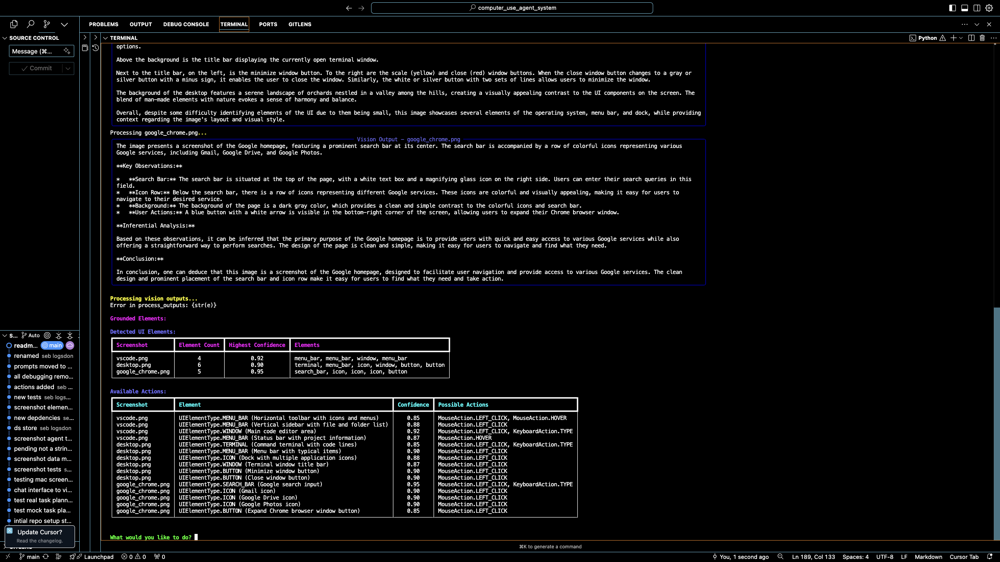

# Computer Use Task List Agent Framework



A robust, production-ready framework for building computer automation agents, powered by vision-language models and designed for extensibility.

## Table of Contents
- [Overview](#overview)
  - [Key Features](#key-features)
  - [Why This Framework?](#why-this-framework)
- [Getting Started](#getting-started)
  - [Prerequisites](#prerequisites)
  - [Installation](#installation)
  - [Running the tests](#running-the-tests)
  - [Running the application](#running-the-application)
- [Extending the Framework](#extending-the-framework)
  - [Adding Tools](#adding-tools)
  - [Customizing Prompts](#customizing-prompts)
  - [Extending Data Models](#extending-data-models)
- [Contributing](#contributing)
- [License](#license)

## Overview

This project provides a solid foundation for building AI-powered computer automation agents. Rather than a complete solution, it's a carefully architected framework that handles the complex tasks of:
- Task planning and decomposition (gpt4o)
- UI element detection and classification (groq (llama-3.2-90b-vision-preview))
- Action recommendation and validation (gpt4o)

The system is deliberately tool-agnostic, allowing developers to integrate their preferred:
- Computer control tools (e.g., PyAutoGUI)
- Object detection models (e.g., Grounding DINO)
- Vision-language models (currently supports GPT-4o and Groq (llama-3.2-90b-vision-preview))

### Key Features

- **Production-Ready Architecture**:
  - Modular design with clear separation of concerns
  - Comprehensive type system using Pydantic
  - Extensive error handling and validation
  - Clean logging and debugging infrastructure

- **Extensible Design**:
  - Pluggable vision model support
  - Customizable system prompts in dedicated prompts/ directory
  - Expandable data models for new UI elements and actions
  - Ready for tool integration (PyAutoGUI, Grounding DINO, etc.)

- **Developer-Friendly**:
  - Clear documentation and examples
  - Test-driven development approach
  - Easy prompt customization
  - Minimal dependencies

### Why This Framework?

Building computer automation agents requires solving several complex problems:
1. Understanding user intentions
2. Breaking down tasks into steps
3. Identifying UI elements
4. Planning appropriate actions
5. Handling errors and validation

This framework handles #1-4 robustly, leaving you to focus on:
- Integrating your preferred tools
- Customizing the behavior for your use case
- Extending the capabilities

## Getting Started

### Prerequisites

- Python 3.11+
- OpenAI API key (for GPT-4o) and Groq API key (for groq (llama-3.2-90b-vision-preview))
- Virtual environment recommended

### Installation

```bash
# Clone the repository
git clone git@github.com:cookieclicker123/computer_use_agent_system.git
cd computer_use_agent_system

# Create and activate virtual environment
python3 -m venv .venv
source .venv/bin/activate  # On Windows: .venv\Scripts\activate

# Install dependencies
pip install -r requirements.txt

# Set up environment variables
cp .env.example .env
# Add your API keys to .env
```

### Running the tests

```bash
python -m pytest tests
```

Individual test files:
```bash
pytest tests/test_task_planner.py
pytest tests/test_screenshot_agent.py
pytest tests/test_vision_output_processor.py
pytest tests/test_vision_grouping.py
pytest tests/test_mock_screenshot_agent.py
```

### Running the application

```bash
python app.py
'open chrome and search for python documentation'
```

This will:
1. Load the test screenshots
2. Create a task plan
3. Detect UI elements
4. Display the results in a clear, formatted way

Example output:
```
🔍 Task Plan:
└── Open Chrome and search for Python documentation
    ├── Exit VSCode
    ├── Find Chrome icon
    ├── Open Chrome
    └── Search for Python docs

📊 Detection Results:
┌─────────────┬───────────┬──────────────┬────────────────┐
│ Screenshot  │ Elements  │ Confidence   │ Types Found    │
├─────────────┼───────────┼──────────────┼────────────────┤
│ vscode.png  │    8      │    0.95      │ WINDOW, MENU   │
│ chrome.png  │    5      │    0.90      │ SEARCH, BUTTON │
└─────────────┴───────────┴──────────────┴────────────────┘

👨‍💻 Available Actions:
┌────────────┬─────────────────────────┬────────────┬─────────────────────┐
│ Screenshot │ Element                 │ Confidence │ Possible Actions    │
├────────────┼─────────────────────────┼────────────┼─────────────────────┤
│ vscode.png │ WINDOW (Code panel)     │    0.95    │ LEFT_CLICK, TYPE    │
│ vscode.png │ MENU_BAR (File menu)    │    0.92    │ LEFT_CLICK          │
│ chrome.png │ SEARCH_BAR (Google)     │    0.90    │ LEFT_CLICK, TYPE    │
│ chrome.png │ BUTTON (Search button)  │    0.88    │ LEFT_CLICK          │
└────────────┴─────────────────────────┴────────────┴─────────────────────┘
```

## Extending the Framework

Here is a rough idea of how to extend the framework. I will have cookbooks for Grouding DINO and PyAutoGUI integration soon.

### Adding Tools

1. **Computer Control**:
```python
from pyautogui import click, typewrite  # Example

def execute_action(action: ActionType, element: DetectedElement):
    if element.bounding_box:
        x, y = element.bounding_box[0:2]
        if action == MouseAction.LEFT_CLICK:
            click(x, y)
```

2. **Object Detection**:
```python
from groundingdino import detect_objects  # Example

def get_bounding_boxes(image_path: str) -> List[BoundingBox]:
    return detect_objects(image_path)
```

### Customizing Prompts

The `src/prompts/` directory contains all system prompts:
- task_planner_prompts.py
- screenshot_agent_prompts.py
- output_processor_prompts.py

Modify these to adjust the agent's behavior and capabilities.

### Extending Data Models

The `src/data_model.py` file defines the core types. Add new UI elements or actions:

```python
class UIElementType(str, Enum):
    DROPDOWN = "dropdown"  # Add new element types
    SLIDER = "slider"

class MouseAction(str, Enum):
    DRAG = "drag"  # Add new actions
    HOVER = "hover"
```

## Contributing

Contributions welcome! Areas for improvement:
- Additional vision model support
- New UI element types and actions
- Tool integrations
- Prompt improvements
- Documentation and examples in prompts should be extended to allow for it to generalise to queries, i've given that freedom to you!

## License

[MIT](LICENSE)
